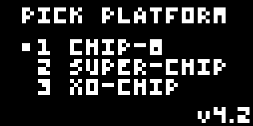
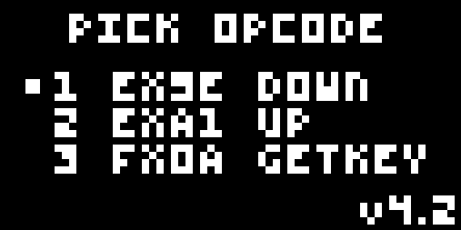
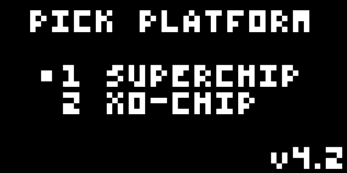

# Chip-8 Interpreter in Zig
This is an implementation of Chip-8 interpreter in Zig. 

For more informations about Chip-8:
- [Cowgod's Chip-8 Technical Reference v1.0](http://devernay.free.fr/hacks/chip8/C8TECH10.HTM)
- [Awesome Chip-8](https://chip-8.github.io/links/)

## Test Suite Status
This is the current status of every test case in [Timendus/chip8-test-suite](https://github.com/Timendus/chip8-test-suite):
- [X] Chip-8 Logo

  
- [X] IBM Logo
  
  
- [X] Corax+ Opcode Test
  
  
- [X] Flags Test
  
  
- [ ] Quirks Test
  
  
- [X] Keypad Test
  
  
- [X] Beep Test (Sound emitted according to test specification)
  
  
- [ ] Scrolling Test
  
  