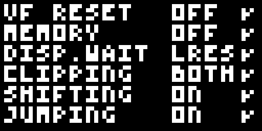
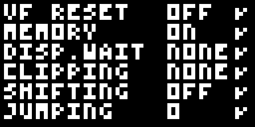

# Chip-8 Interpreter in Zig
This is an implementation of Chip-8 interpreter in Zig. 

For more informations about Chip-8:
- [Cowgod's Chip-8 Technical Reference v1.0](http://devernay.free.fr/hacks/chip8/C8TECH10.HTM)
- [Awesome Chip-8](https://chip-8.github.io/links/)

## Test Suite Status
This is the current status of every test case in [Timendus/chip8-test-suite](https://github.com/Timendus/chip8-test-suite):
- [X] Chip-8 Logo (`./chip_8_emu roms/1-chip8-logo.ch8`)

  
- [X] IBM Logo (`./chip_8_emu roms/2-ibm-logo.ch8`)
  
  
- [X] Corax+ Opcode Test (`./chip_8_emu roms/3-corax+.ch8`)
  
  
- [X] Flags Test (`./chip_8_emu roms/4-flags.ch8`)
  
  
- [X] Quirks Test
  
  - [X] Chip-8 (`./chip_8_emu -m 1FF=1 roms/5-quirks.ch8`)
  
    

  - [X] Super-Chip (Modern) (`./chip_8_emu -t 20 -b schip -m 1FF=2 roms/5-quirks.ch8`)
  
    

  - [X] Super-Chip (Legacy) (`./chip_8_emu -b schip -m 1FF=4 roms/5-quirks.ch8`)
  
    

  - [X] XO-Chip (`./chip_8_emu -t 20 -b xochip -m 1FF=3 roms/5-quirks.ch8`)
  
    
  
- [X] Keypad Test
  - [X] KeyUp (`./chip_8_emu -t 20 -m 1FF=1 roms/6-keypad.ch8`)
  
    

  - [X] KeyDown (`./chip_8_emu -t 20 -m 1FF=2 roms/6-keypad.ch8`)
  
    

  - [X] GetKey (`./chip_8_emu -t 20 -m 1FF=3 roms/6-keypad.ch8`)
  
    
- [X] Beep Test (Sound emitted according to test specification) (`./chip_8_emu roms/7-beep.ch8`)
  
  
- [ ] Scrolling Test (`./chip_8_emu roms/8-scrolling.ch8`)
  - [ ] Super-Chip (Modern + lores) (`./chip_8_emu -m 1FF=1 roms/8-scrolling.ch8`)
  
    

  - [ ] Super-Chip (Legacy + lores)  (`./chip_8_emu -m 1FF=2 roms/8-scrolling.ch8`)
  
    

  - [ ] Super-Chip (hires) (`./chip_8_emu -m 1FF=3 roms/8-scrolling.ch8`)
  
    

  - [ ] XO-Chip (lores) (`./chip_8_emu -m 1FF=4 roms/8-scrolling.ch8`)
  
    

  - [ ] XO-Chip (hires) (`./chip_8_emu -m 1FF=5 roms/8-scrolling.ch8`)
  
    
